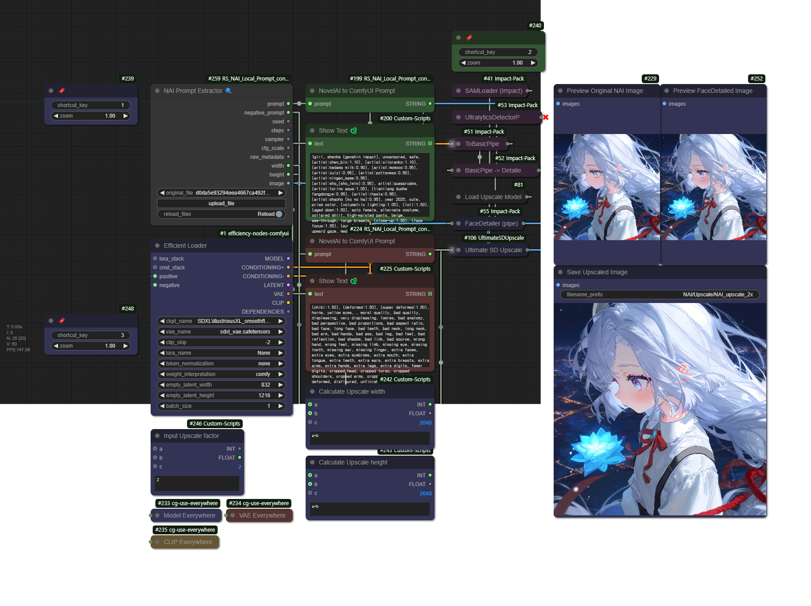

# ComfyUI NAI Prompt Converter

Original source code credit:
The prompt_to_stack function is based on the code from:
https://github.com/bedovyy/ComfyUI_NAIDGenerator/blob/master/utils.py#L146
Author: bedovyy
Modified for Novel AI to ComfyUI conversion purposes.

This code was entirely created by Claude 3.5 Sonnet.

A custom node extension for ComfyUI that enables conversion between NovelAI and ComfyUI prompt formats, along with extraction of NovelAI metadata from PNG images.

## Features

### NAI Prompt Extractor Node
- Extracts metadata from NovelAI-generated PNG images including:
  - Prompt
  - Negative prompt
  - Seed
  - Steps
  - Sampler
  - CFG scale
  - Raw metadata
  - Image dimensions
- Supports direct image upload through the UI
- Specifically designed for PNG files with NovelAI metadata

### Prompt Format Conversion
Provides bidirectional conversion between NovelAI and ComfyUI prompt formats:

#### Novel AI → ComfyUI
- Converts NovelAI's bracket-based emphasis notation to ComfyUI's weight format
  - `{tag}` → `(tag:1.05)`
  - `{{tag}}` → `(tag:1.10)`
  - `[tag]` → `(tag:0.95)`
  - `[[tag]]` → `(tag:0.90)`

#### ComfyUI → Novel AI
- Converts ComfyUI's weight format to NovelAI's bracket notation
  - `(tag:1.05)` → `{tag}`
  - `(tag:1.10)` → `{{tag}}`
  - `(tag:0.95)` → `[tag]`
  - `(tag:0.90)` → `[[tag]]`

### Special Tag Handling
- Preserves character tags in various formats:
  - Basic: `character (series)`
  - With options: `character (series) (outfit) (pose)`
  - Underscore format: `character_(series)`
  - Escaped format: `character \(series\)`
- Maintains correct formatting for `artist:` tags

## Installation

1. Clone this repository into your ComfyUI's custom nodes directory:
```bash
cd ComfyUI/custom_nodes
git clone https://github.com/raspie10032/ComfyUI_RS_NAI_Local_Prompt_converter
```

2. Restart ComfyUI

## Example Workflow



*The workflow is embedded in the PNG metadata - just drag and drop the image to load it in ComfyUI*

### Extensions Required for Example Workflow

**ComfyUI-Manager**
- https://github.com/ltdrdata/ComfyUI-Manager

**ComfyUI Impact Pack**
- https://github.com/ltdrdata/ComfyUI-Impact-Pack

**Efficiency Nodes for ComfyUI Version 2.0+**
- https://github.com/jags111/efficiency-nodes-comfyui

**pythongosssss/ComfyUI-Custom-Scripts**
- https://github.com/pythongosssss/ComfyUI-Custom-Scripts

**UltimateSDUpscale**
- https://github.com/ssitu/ComfyUI_UltimateSDUpscale

**rgthree's ComfyUI Nodes**
- https://github.com/rgthree/rgthree-comfy

**Use Everywhere (UE Nodes)**
- https://github.com/chrisgoringe/cg-use-everywhere

## Usage Rights
This code is freely available for anyone to use, modify, and distribute without any restrictions. You can use it for any purpose, including personal and commercial projects.

## Code References

This project incorporates code and techniques from the following sources:

### ComfyUI NAIDGenerator
- Repository: https://github.com/bedovyy/ComfyUI_NAIDGenerator
- Author: bedovyy
- Used for: Prompt conversion functionality and base implementation

### NovelAI Image Metadata
- Repository: https://github.com/NovelAI/novelai-image-metadata
- Author: NovelAI
- Used for: LSB-based metadata extraction technique and stealth watermark handling

Special thanks to the authors and contributors of these projects for their valuable work and making their code available to the community.